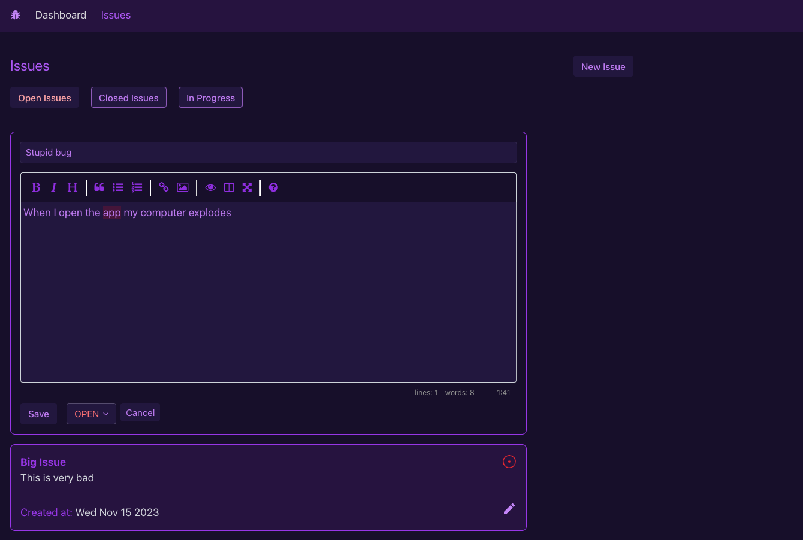

## Issue Tracker Project

I started this project to familiarize myself with Prisma, and NextJS API routing. I wanted to build a simple app that takes in inputs from the user and persists it into a backend. I experimented with different use cases such as filtering data by a specific property, and updating data in the database that immediately reflected on the frontend, creating a fluid user experience.

